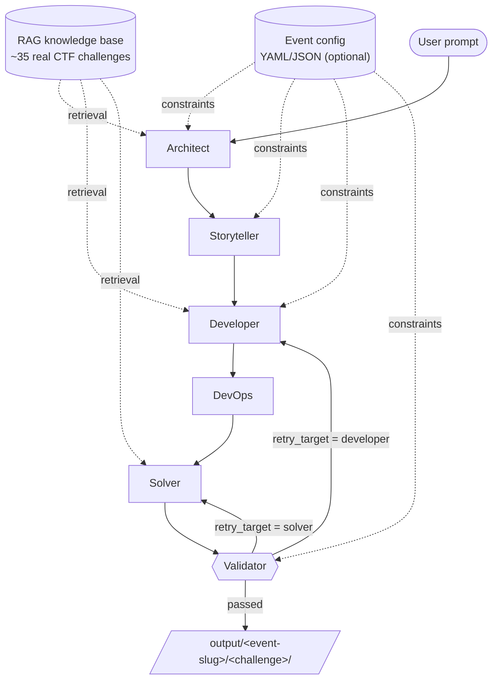

# CTF-POC: AI-Powered CTF Challenge Generator

A multi-agent system that designs, codes, packages, and verifies Capture-The-Flag challenges from a single natural-language prompt. Outputs a ready-to-deploy folder with source code, a Dockerfile, a solve script, and a player-facing README — verified by running the exploit against the challenge in a sandboxed Docker container.

---

## Input Modes

### Mode 1 — Topic-based (primary)

> *"I want a `<difficulty>` `<category>` challenge related to `<topic / vulnerability / tool>`."*

Any combination of the three slots is accepted; the Architect fills in the rest from the RAG corpus.

```bash
ctf-poc "Create a hard reverse engineering challenge that requires Z3 to solve"
ctf-poc "Easy web challenge about JWT bypass"
ctf-poc "Medium crypto challenge using AES nonce reuse"
ctf-poc "Pwn challenge"                # category only — Architect picks difficulty + topic
```

### Mode 2 — CVE-based

> *"I want a challenge inspired by `CVE-YYYY-NNNNN`."*

The Architect distils the CVE into a vulnerability primitive and adapts it into a self-contained challenge (not a reproduction of the real-world system).

```bash
ctf-poc "Build a challenge inspired by CVE-2024-3094"
```

Mode 1 is the priority surface; Mode 2 reuses the same pipeline with CVE-aware context retrieval.

---

## Event Config (optional)

Either mode above can be paired with an **event config file** (YAML or JSON) that defines event-wide constraints — flag format, story tone/theme, audience, organizer, forbidden techniques — plus per-agent model routing. One config drives every challenge generated under it.

```bash
ctf-poc "Medium web challenge about SQL injection" --config examples/configs/megactf-2026.yaml
```

### Required fields

| Field | Type | Notes |
|---|---|---|
| `name` | string | Event name (e.g. `MegaCTF 2026`). Slugified for the output sub-directory. |
| `flag_regex` | regex | Every generated flag must match. Mechanically enforced to require a minimum length — regexes that match strings shorter than 2 chars are rejected at load time. |

### Optional fields

| Field | Type | Default | Consumer |
|---|---|---|---|
| `theme` | string | `None` → Storyteller picks freely | Storyteller |
| `tone` | enum: `formal` / `informal` / `humorous` / `dark` / `noir` | `informal` | Storyteller |
| `organizer` | string | none | Storyteller (story flavor) |
| `audience` | enum: `beginner` / `intermediate` / `expert` / `mixed` | `mixed` | Architect (difficulty calibration) |
| `language` | ISO 639-1 string | `en` | Storyteller (player-facing text) |
| `forbidden_categories` | list of categories | `[]` | Architect |
| `forbidden_techniques` | list of strings | `[]` | Architect + Developer |
| `default_model` | `<provider>:<model>` | `google-gla:gemini-2.5-flash` | All agents (fallback) |
| `models` | per-agent map | empty | Architect / Storyteller / Developer / DevOps / Solver / Validator |
| `max_retries` | int | `3` | Pipeline |
| `use_sandbox` | bool | `true` | Validator |
| `rag_top_k` | int | `3` | RAG retriever |

### Per-agent model routing

The `models:` block lets you route different agents to different providers — typically harder reasoning to stronger models, story/devops to cheaper ones:

```yaml
default_model: google-gla:gemini-2.5-flash
models:
  architect: openai:gpt-4.1
  solver: anthropic:claude-sonnet-4-5
```

Precedence (highest first): **CLI `--model`** → `models.<agent>` → `default_model` → built-in default.

### Supported providers

Any pydantic-ai provider prefix works. Common choices:

| Prefix | Required env | Notes |
|---|---|---|
| `google-gla:` | `GEMINI_API_KEY` | Free tier available. Also drives RAG embeddings. |
| `openai:` | `OPENAI_API_KEY` | |
| `anthropic:` | `ANTHROPIC_API_KEY` | |
| `openrouter:<provider>/<model>` | `OPENROUTER_API_KEY` | One key, every model. OpenRouter dashboard surfaces our spend under app_title `ToroidBot` (set automatically). |

**RAG embeddings stay on Gemini AI Studio** regardless of which provider drives the agents. OpenRouter does not proxy Gemini embeddings, and switching embedders mid-corpus would invalidate the indexed vectors. The `GEMINI_API_KEY` is therefore required if you use RAG retrieval, even when every agent is routed through OpenRouter.

### Override precedence

CLI flags always beat the config:

```bash
ctf-poc "..." --config event.yaml --model openai:gpt-4.1   # CLI --model wins
ctf-poc "..." --config event.yaml --no-sandbox             # forces use_sandbox=false
ctf-poc "..." --config event.yaml --max-retries 10         # overrides config max_retries
```

### Sample configs

- [`examples/configs/megactf-2026.yaml`](examples/configs/megactf-2026.yaml) — full-fat YAML with every field populated; mix of direct provider keys (`openai:`, `anthropic:`).
- [`examples/configs/openrouter.yaml`](examples/configs/openrouter.yaml) — every agent routed through OpenRouter with one `OPENROUTER_API_KEY`.
- [`examples/configs/gemini-only.yaml`](examples/configs/gemini-only.yaml) — every agent on `google-gla:gemini-2.5-flash`, sandbox off; for contributors who only have an AI Studio key.
- [`examples/configs/minimal.json`](examples/configs/minimal.json) — required fields only.

For the full schema, see [`docs/superpowers/specs/2026-05-14-event-config-design.md`](docs/superpowers/specs/2026-05-14-event-config-design.md).

---

## Architecture



**Validator** runs two layers:

1. **Deterministic sandbox** (`DockerSandbox`) — `flag_not_in_source` → `flag_matches_regex` (when event set) → `docker_build` → `container_start` (on a private `--internal` network) → `solver_run` (in a **sibling container** on the same network, read-only fs, `--cap-drop ALL`) → `flag_captured`.
2. **LLM review** — looks for unintended bugs the sandbox can't see (info leaks, default credentials, extra attack surface).

If validation fails, the Validator names a **retry target**: `developer` reruns the full build (code + infra + solver), `solver` reruns only the exploit script. Retry budget is configurable.

---

## Quick Start

```bash
# 1. Install
git clone <repo> && cd ToroidBot
python -m venv .venv && source .venv/bin/activate
pip install -e ".[dev]"

# 2. Configure (pick any supported provider)
echo "GEMINI_API_KEY=your-key" > .env

# 3a. Generate a one-off challenge
ctf-poc "Medium web challenge about SQL injection"

# 3b. Or generate under an event config (event-wide tone, theme, flag format, model routing)
ctf-poc "Medium web challenge about SQL injection" --config examples/configs/megactf-2026.yaml

# 3c. Skip the Docker sandbox for a faster LLM-only run
ctf-poc "Easy crypto challenge with RSA" --no-sandbox

# 4. Inspect the output
ls output/
```

Supported providers (anything Pydantic-AI supports via `<provider>:<model>`):

```bash
--model google-gla:gemini-2.5-flash      # default
--model openai:gpt-4.1
--model anthropic:claude-sonnet-4-5
```

---

## Output Layout

Without an event config:

```
output/<challenge-name>/
├── <source files…>          # Developer's code
├── Dockerfile               # DevOps deployment config
├── docker-compose.yml       # only if multi-service
├── solve.py                 # Solver's exploit script
├── README.md                # Storyteller's player-facing description + hints
└── challenge_meta.json      # full pipeline state (manifest, story, code, infra, solver, validation)
```

With an event config, challenges nest under the slugified event name:

```
output/<event-slug>/<challenge-name>/
├── <source files…>
├── Dockerfile
└── …
```

---

## Project Structure

```
agents/
├── schemas.py               # Pydantic models for every pipeline stage (CTFState, ChallengeManifest, …)
├── event_config.py          # EventConfig schema + YAML/JSON loader + slugifier
├── factory.py               # Builds Pydantic-AI agents from skill files + output schemas
└── skill_loader.py          # Loads + caches skills/*.md

graph/
├── pipeline.py              # Linear chain with retry_target-aware partial reruns
└── nodes/                   # One async node per agent — each composes its prompt from state + event

orchestrator/
├── main.py                  # CLI entry point (`ctf-poc`), --config flag, override precedence
├── rag.py                   # Keyword RAG over dataset/formated_rag_data/
└── output.py                # Writes challenge files; nests under event slug when set

sandbox/
└── docker_runtime.py        # DockerSandbox: build / start / sibling-container solver / teardown

skills/                      # Agent personas (markdown, editable without touching code)
├── rules.md                 # Global constraints (security, output format, handoff)
├── rag_architect.md
├── storyteller.md
├── ctf_developer.md
├── devops_infra.md
├── exploit_solver.md
└── validator.md

examples/configs/            # Sample event configs (YAML + JSON)
├── megactf-2026.yaml        # full-fat
└── minimal.json             # required fields only

dataset/formated_rag_data/   # ~35 hand-formatted CTF challenges used as RAG corpus
docs/superpowers/            # Design specs and implementation plans
tests/                       # 106 unit tests + a Docker-gated E2E sandbox test
```

---

## Key Design Decisions

| Decision | Why |
|---|---|
| **Pydantic-AI** (not LangGraph yet) | Structured output via Pydantic schemas, model-agnostic providers. LangGraph integration is planned for the retry loop. |
| **Agent personas in `skills/*.md`** | Tweak prompts without touching code. The Architect's behaviour is a markdown file, not a string literal. |
| **Event config as optional layer, not required** | One-off invocations stay terse (`ctf-poc "prompt"`). Multi-challenge events get reproducible, regex-enforced flag formats and consistent tone/theme via `--config event.yaml`. |
| **Per-agent model routing via config** | `models.architect: openai:gpt-4.1`, `models.solver: anthropic:claude-sonnet-4-5`. CLI `--model` overrides everything. |
| **Mechanical flag-regex enforcement** | Pydantic validator probes the regex with short strings at load time; configs that allow too-short flags fail before any LLM call. |
| **RAG-driven, not template-driven** (for now) | Implementation choices (language, services, tools) are derived from real challenge examples, not a static enum. |
| **Validator does both deterministic + LLM checks** | The sandbox proves the challenge *works*. The LLM catches qualitative issues the sandbox can't see. |
| **Solver runs in a sibling container, not on the host** | LLM-generated exploit code never touches the developer's machine. Read-only fs, dropped caps, private internal network. |
| **`manifest.name` constrained by Pydantic regex** | LLM output flows directly into `docker run --name …` and image tags — must be safe. |
| **Model-agnostic via `<provider>:<model>`** | Gemini for speed, Claude/GPT for harder reasoning. No code change to switch. |

---

## Roadmap

### Skills to add or improve

The current 7 skills are intentionally generic. The clear gaps:

| Skill | Purpose | Status |
|---|---|---|
| `cve_distiller` | Parse a CVE report, extract the vulnerability primitive, propose a self-contained adaptation. Powers Mode 2 properly. | needed |
| `difficulty_calibrator` | Verifies generated challenge complexity matches the requested level by comparing against RAG examples at the same difficulty. | needed |
| `writeup_writer` | Post-CTF teaching writeup (separate from the machine-runnable solve script). | nice-to-have |
| `web_developer` / `pwn_developer` / `crypto_developer` / `rev_developer` | Split `ctf_developer.md` per category — language idioms, common vuln-embedding patterns, framework choices differ wildly. | should split once we hit quality issues |
| `z3_solver` / `angr_solver` / `pwntools_solver` | Tool-specific solver expertise for hard challenges. | nice-to-have |
| `devops_infra` | Strengthen the existing skill: split into base-image selection + hardening review, add per-category Dockerfile patterns (socat for pwn, gunicorn for web, etc.). | improve in place |
| `validator` | Add category-specific "unintended bug" heuristics (e.g., web → check for missing CSRF tokens unless the challenge *is* CSRF). | improve in place |

### Templates vs RAG

**Recommendation: hybrid.** Use RAG for creative content (vulnerability embedding, exploit technique, story), templates for infrastructure boilerplate.

| Layer | Approach | Why |
|---|---|---|
| Story, vulnerability embedding, exploit technique | **RAG** | Needs variety, learns from real examples, hard to enumerate |
| Dockerfile base, server skeleton, dependency lists | **Templates** | Repetitive, regulated, doesn't benefit from creativity — and token-expensive to regenerate from scratch every run |
| Solve-script scaffolding (connection setup, retry-with-backoff) | **Templates** | Same reasoning |

Concretely: add `templates/<category>/<language>/Dockerfile.j2` and let DevOps pick the closest template, then adapt via RAG-guided modifications. Cuts token cost and increases consistency without losing the dynamic part.

### Other planned work

- **Vector RAG** — replace keyword matching in `orchestrator/rag.py` with pgvector or ChromaDB. Biggest single quality lever for queries like *"subtle deserialization bug"*.
- **LangGraph integration** — replace the manual retry loop in `graph/pipeline.py` with a real state machine. Better retry budgets, branching, visualization. (See DEV.md.)
- **AI Gateway** — unified provider routing via Pydantic AI Gateway so we can mix providers without per-key plumbing.
- **Batch mode** — generate a 10-challenge CTF event from a single category-list config, paired with `--config`.
- **Web UI** — Streamlit/Gradio frontend over the CLI.
- **Per-category quality bar** — at least one fully verified generated challenge per category (web, pwn, rev, crypto, misc, forensics) committed under `examples/`.

---

## Development

```bash
# Run the unit suite (fast, no Docker needed)
pytest tests/ -v --ignore tests/test_sandbox_e2e.py

# Full suite including the Docker E2E test
pytest tests/ -v   # E2E auto-skips if docker daemon isn't up

# Lint
ruff check .
```

See [`DEV.md`](DEV.md) for full architecture, RAG schema, and tech-stack rationale.
See [`docs/superpowers/`](docs/superpowers/) for design specs and implementation plans.

## API & Developer Notes (2026-05-15)

This repository now includes a development FastAPI server that exposes a compact REST/WebSocket surface for driving the multi-agent pipeline (MVP/dev use). Use this section to get started and to understand the `simulator vs real orchestrator` toggle.

- **Dev server entrypoint**: `api/main.py` (FastAPI app). Run locally with:

```bash
uvicorn api.main:app --reload --port 8000
```

- **Important env toggles**:
  - `USE_REAL_ORCHESTRATOR` (default: false) — When truthy the service will attempt to call the repo's real orchestrator (`graph.pipeline.run_pipeline` + `orchestrator.output.save_challenge`). Only enable in a properly provisioned environment (provider keys, DB, Docker, and other dependencies).
  - `TOROIDBOT_ADMIN_KEY` — Required for admin-only endpoints (settings, debug, some skill/preset writes). Requests must include header `X-API-Key: <value>`.

- **Core endpoints (dev surface)** — See `api/routes/*` for implementations and `API_ENDPOINTS_PLAN.md` for the design. Key routes include:
  - `POST /generate` — start a run (returns `run_id`).
  - `GET /runs` & `GET /runs/{run_id}` — list and inspect runs.
  - WebSocket `ws://.../ws/runs/{run_id}` — realtime streaming of pipeline stage events.
  - SSE `GET /runs/{run_id}/events` — server-sent events fallback when WS is not used.
  - `GET /runs/{run_id}/artifacts` and `GET /runs/{run_id}/artifacts/{path}` — list and download artifacts.
  - KB management under `/kb` (import/list/search), skills under `/skills`, presets under `/presets`, and agent execution helper under `/agents/{agent_name}/execute`.

- **Simulator vs Real orchestrator**:
  - The default developer-friendly behaviour uses an in-memory simulator so unit tests and local development run quickly without external providers or heavy deps.
  - When `USE_REAL_ORCHESTRATOR` is enabled and the runtime can import the orchestrator modules, the server will call into the real pipeline. This requires provider API keys (e.g., `GEMINI_API_KEY`) and any DB or vector-store services the orchestrator depends on.

- **Tests**:
  - Fast local tests that exercise the API surface without heavy external deps: `pytest tests/test_api_endpoints.py`.
  - The full test suite includes integration/E2E tests that may require Docker, provider keys, or DB services; expect collection failures if those optional deps are not present.

- **Dev notes / where to look**:
  - Orchestrator facade used by the API: `api/services/orchestrator.py` (gates real pipeline usage behind `USE_REAL_ORCHESTRATOR`).
  - Routes live in `api/routes/` and schemas in `api/schemas.py`.
  - Admin auth helper: `api/auth.py`.

If you change the API surface, routes, or environment variables, update this README (endpoints, required env vars, and test instructions) so other contributors and CI understand the change.
